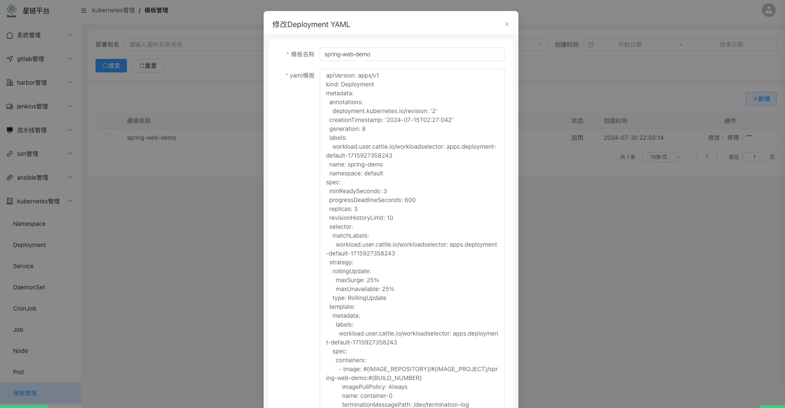

### 1. 硬件要求
```html
    最低要求为：4核8G
```
### 2. 软件要求

```html
1. docker
2. docker compose
```

### 3. 检查宿主机端口
```
请保持宿主机上以下端口未被占用。

8848  ： nginx端口
3306  ： mysql
19876 : rocket-mq-console端口 

5022  ：  一台Linux服务器（内部开放端口为22）
5023  ：  一台Linux服务器（内部开放端口为22）

8070  ： jenkins服务器（内部开放端口为8080）
```
### 4. 项目结构
```shell

[app@starlink-server ~]$  git clone git@github.com:help-lixin/starlink-docker.git
[app@starlink-server ~]$  cd starlink-docker
[app@starlink-server starlink-docker]$ tree -L 2
.
├── docker-compose.yml
├── .env                        # docker-compose 配置文件
├── LICENSE
├── nginx                       # nginx 目录
│   └── conf.d
│       └── starlink.lixin.help.conf
├── README.md
├── rocketmq
│   └── broker
│       └── conf
└── tools                       # 存放linux下常用工具包(jdk/maven/gradle/ant...)
    ├── ant-1.9.16
    │   ├── bin
    │   ├── CONTRIBUTORS
    │   ├── contributors.xml
    │   ├── etc
    │   ├── fetch.xml
    │   ├── get-m2.xml
    │   ├── INSTALL
    │   ├── KEYS
    │   ├── lib
    │   ├── LICENSE
    │   ├── manual
    │   ├── NOTICE
    │   ├── patch.xml
    │   ├── README
    │   └── WHATSNEW
    ├── go1.21.3
    │   ├── api
    │   ├── bin
    │   ├── codereview.cfg
    │   ├── CONTRIBUTING.md
    │   ├── doc
    │   ├── go.env
    │   ├── lib
    │   ├── LICENSE
    │   ├── misc
    │   ├── PATENTS
    │   ├── pkg
    │   ├── README.md
    │   ├── SECURITY.md
    │   ├── src
    │   ├── test
    │   └── VERSION
    ├── gradle-7.6.3
    │   ├── bin
    │   ├── init.d
    │   ├── lib
    │   ├── LICENSE
    │   ├── NOTICE
    │   └── README
    ├── .init
    ├── jdk1.8.0_361
    │   ├── bin
    │   ├── COPYRIGHT
    │   ├── include
    │   ├── javafx-src.zip
    │   ├── jmc.txt
    │   ├── jre
    │   ├── jvisualvm.txt
    │   ├── legal
    │   ├── lib
    │   ├── LICENSE
    │   ├── man
    │   ├── README.html
    │   ├── release
    │   ├── src.zip
    │   ├── THIRDPARTYLICENSEREADME-JAVAFX.txt
    │   └── THIRDPARTYLICENSEREADME.txt
    ├── maven-3.6.3
    │   ├── bin
    │   ├── boot
    │   ├── conf
    │   ├── lib
    │   ├── LICENSE
    │   ├── NOTICE
    │   └── README.txt
    └── node-v16.20.2
        ├── bin
        ├── CHANGELOG.md
        ├── include
        ├── lib
        ├── LICENSE
        ├── README.md
        └── share
```
### 5. 安装前注意事项
```html
1. 我的宿主机的IP地址为： 192.168.8.50
2. 如果，使用docker-compose里的ssh和jenkins，则只能在一台为centos宿主机上进行安装该应用，因为，ssh容器和jenkins容器，是直接挂载了宿主机的docker进入容器内部，以供容器内部直接使用。
3. 由于项目用到了OAUTH 2.0授权，所以，在"启动之前"需要修改：.env文件
    OAUTH_DEFAULT_CLIENT_AUTHORIZE_URL=http://192.168.8.50:8848/passport/oauth/authorize?response_type=code&client_id=client1&scope=all
4. 在启动之后，需要修改表:system.oauth_client_details,否则，无法登录。
    http://192.168.8.50:8848/passport/authorized
```

### 6. 一键启动,并等待应用完成启动
```shell
# 进入项目目录
[app@starlink-server ~]$  cd starlink-docker
# docker-compose一键后台启动
[app@starlink-server starlink-docker]$ docker-compose up -d
# 查看starlink容器日志
[app@starlink-server starlink-docker]$ docker-compose logs -f starlink
```

### 7. 安装jenkins

```
注意事项：
    1. 安装jenkins时，不需要安装任何插件，全部托管给我们即可，starlink在对jenkins进行托管时，会自动安装：golang、nodejs、git、subversion、gradle、ant、gitlab-plugin
    2. 手工配置下jenkins站点更新URL，如下图
```


### 8. 核心概念介绍
```html
插件定义： 在starlink里，插件代表：gitlab、jenkins、harbor
插件实例：在一家公司插件（例如：jenkins）可能会存在多台。每个项目组是隔离的。
凭证： 凭证是对所有的插件进行抽象之后的概念，比如： jenkins需要配置gitlab的凭证信息、k8s需要配置仓库凭证信息。。。
```

### 9. 添加插件实例


### 10. 添加凭证


### 11. jenkins系统配置


### 12. 配置ssh标签


### 13. k8s配置deployment模板



```yaml
apiVersion: apps/v1
kind: Deployment
metadata:
  annotations:
    deployment.kubernetes.io/revision: '2'
  creationTimestamp: '2024-07-15T02:27:04Z'
  generation: 8
  labels:
    workload.user.cattle.io/workloadselector: apps.deployment-default-1715927358243
  name: spring-demo
  namespace: default
spec:
  minReadySeconds: 3
  progressDeadlineSeconds: 600
  replicas: 3
  revisionHistoryLimit: 10
  selector:
    matchLabels:
      workload.user.cattle.io/workloadselector: apps.deployment-default-1715927358243
  strategy:
    rollingUpdate:
      maxSurge: 25%
      maxUnavailable: 25%
    type: RollingUpdate
  template:
    metadata:
      labels:
        workload.user.cattle.io/workloadselector: apps.deployment-default-1715927358243
    spec:
      containers:
        - image: #{IMAGE_REPOSITORY}/#{IMAGE_PROJECT}/spring-web-demo:#{BUILD_NUMBER}
          imagePullPolicy: Always
          name: container-0
          terminationMessagePath: /dev/termination-log
          terminationMessagePolicy: File
      dnsPolicy: ClusterFirst
      imagePullSecrets:
        - name: #{IMAGE_PULL_SECRET_NAME}
      restartPolicy: Always
      schedulerName: default-scheduler
      securityContext: {}
      serviceAccount: default
      serviceAccountName: default
      terminationGracePeriodSeconds: 30
```

### 14. 创建流水线一(gitlab代码下载+ssh编译+harbor镜像仓库配置+docker生成镜像+k8s部署)


### 15. 运行流水线一(gitlab代码下载+ssh编译+harbor镜像仓库配置+docker生成镜像+k8s部署)


### 16. 创建流水线二(gitlab代码下载+ssh编译+ssh部署)


### 17. 运行流水线二(jenkins打包+harbor镜像配置+docker生成镜像+k8s部署)


### 18. 运行流水线三(jenkins打包+ssh部署)


